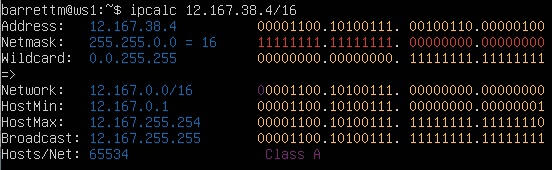
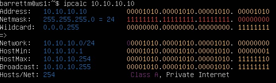
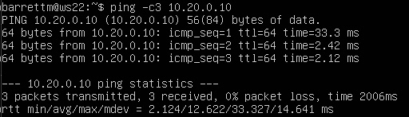
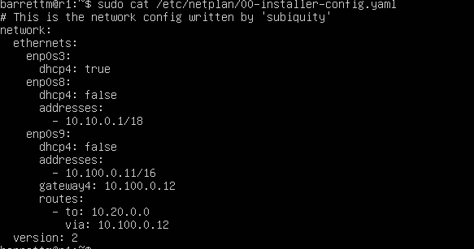
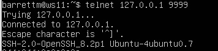

## Part 1. Инструмент **ipcalc**

#### 1.1. Сети и маски
##### Определить и записать в отчёт:
##### 1) адрес сети *192.167.38.54/13*


#### 2) перевод маски 
 - *255.255.255.0* 


##### префиксная запись - 24, двичная запись - 11111111.11111111.11111111.00000000
- */15*


##### обычная запись 255.254.0.0, двоичная запись - 11111111.11111110.00000000.00000000

 - *11111111.11111111.11111111.11110000* (считаем ручками)
##### обычная - 255.255.255.240, префиксная -  28

#### 3) минимальный и максимальный хост в сети *12.167.38.4* 
#### при маске: 
 - */8* 


##### Минимальный хост - 12.0.0.1, максимальный - 12.255.255.254
- *11111111.11111111.00000000.00000000*



##### Минимальный хост - 12.167.0.1, максимальный - 12.167.255.254

- *255.255.254.0*


##### Минимальный хост - 12.167.38.1, максимальный - 12.167.39.254
- */4*


##### Минимальный хост - 15.255.255.254, максимальный - 15.255.255.255

#### 1.2. localhost
##### Определить и записать в отчёт, можно ли обратиться к приложению, работающему на localhost, со следующими IP:
- *194.34.23.100* - нет
- *127.0.0.2* - возможно
- *127.1.0.1* - возможно
- *128.0.0.1* - нет

#### 1.3. Диапазоны и сегменты сетей
##### Определить и записать в отчёт:
##### 1) какие из перечисленных IP можно использовать в качестве публичного, а какие только в качестве частных:
- *10.0.0.45* - частная


- *134.43.0.2* - публичная


- *192.168.4.2* - частная


- *172.20.250.4* - частная


- *172.0.2.1* - публичная


- *192.172.0.1* - публичная


- *172.68.0.2* - публичная


- *172.16.255.255* - частная


- *10.10.10.10* - частная



- *192.169.168.1* - публичная


##### 2) какие из перечисленных IP адресов шлюза возможны у сети *10.10.0.0/18*: 


##### HostMin - 10.10.0.1, HostMax - 10.10.63.254, поэтому
- *10.0.0.1* - невозможно
- *10.10.0.2* - возможно
- *10.10.10.10* - возможно
- *10.10.100.1* - невозможно
- *10.10.1.255* - возможно

## Part 2. Статическая маршрутизация между двумя машинами

##### Поднять две виртуальные машины (далее -- ws1 и ws2)

##### С помощью команды `ip a` посмотреть существующие сетевые интерфейсы
- ws1


- ws2


##### Описать сетевые интерфейсы
- ws1: *192.168.100.10/16*


- ws2: - *172.24.116.8/12*


##### Выполнить команду `netplan apply` для перезапуска сервиса сети


#### 2.1. Добавление статического маршрута вручную
##### Добавить статический маршрут от одной машины до другой и обратно при помощи команды вида `ip r add`
##### Пропинговать соединение между машинами


#### 2.2. Добавление статического маршрута с сохранением
##### Перезапустить машины
##### Добавить статический маршрут от одной машины до другой с помощью файла *etc/netplan/00-installer-config.yaml*


##### Пропинговать соединение между машинами


## Part 3. Утилита **iperf3**

#### 3.1. Скорость соединения
##### 8 Mbps = 1 MB/s, 100 MB/s = 800000 Kbps, 1 Gbps = 1000 Mbps 

#### 3.2. Утилита **iperf3**
##### Измерить скорость соединения между ws1 и ws2


## Part 4. Сетевой экран
#### 4.1. Утилита **iptables**
##### Создать файл */etc/firewall.sh*, имитирующий фаерволл, на ws1 и ws2:
```shell
#!/bin/sh

# Удаление всех правил в таблице "filter" (по-умолчанию).
iptables –F
iptables -X
```
##### Нужно добавить в файл подряд следующие правила:
##### 1) на ws1 применить стратегию когда в начале пишется запрещающее правило, а в конце пишется разрешающее правило (это касается пунктов 4 и 5)
##### 2) на ws2 применить стратегию когда в начале пишется разрешающее правило, а в конце пишется запрещающее правило (это касается пунктов 4 и 5)
##### 3) открыть на машинах доступ для порта 22 (ssh) и порта 80 (http)
##### 4) запретить *echo reply* (машина не должна "пинговаться”, т.е. должна быть блокировка на OUTPUT)
##### 5) разрешить *echo reply* (машина должна "пинговаться")


##### Разница между подходами в том, что в случае запрещающего правила с начала есть возможность потерять удаленный доступ к серверу. (Применяется если есть консольный доступ к серверу).

##### В случае разрешающего, правила новые правила необходимо добавлять в цепочку перед запрещающим правилом.


#### 4.2. Утилита **nmap**
##### Командой **ping** найти машину, которая не "пингуется", после чего утилитой **nmap** показать, что хост машины запущен

##### ws1 - пингуется, ws2 - не пингуется


*Проверка: в выводе nmap должно быть сказано: `Host is up`*


##### Сохранить дампы образов виртуальных машин


## Part 5. Статическая маршрутизация сети

##### Поднять пять виртуальных машин (3 рабочие станции (ws11, ws21, ws22) и 2 роутера (r1, r2))

#### 5.1. Настройка адресов машин
##### Настроить конфигурации машин в *etc/netplan/00-installer-config.yaml* согласно сети на рисунке.


##### Перезапустить сервис сети. Если ошибок нет, то командой `ip -4 a` проверить, что адрес машины задан верно. Также пропинговать ws22 с ws21. Аналогично пропинговать r1 с ws11.





#### 5.2. Включение переадресации IP-адресов.
##### Для включения переадресации IP, выполните команду на роутерах:
`sysctl -w net.ipv4.ip_forward=1`
*При таком подходе переадресация не будет работать после перезагрузки системы.*


##### Откройте файл */etc/sysctl.conf* и добавьте в него следующую строку:
`net.ipv4.ip_forward = 1`
*При использовании этого подхода, IP-переадресация включена на постоянной основе.*


#### 5.3. Установка маршрута по-умолчанию
##### Настроить маршрут по-умолчанию (шлюз) для рабочих станций. Для этого добавить `default` перед IP роутера в файле конфигураций


##### Вызвать `ip r` и показать, что добавился маршрут в таблицу маршрутизации


##### Пропинговать с ws11 роутер r2 и показать на r2, что пинг доходит. Для этого использовать команду:


`tcpdump -tn -i eth1`


#### 5.4. Добавление статических маршрутов
##### Добавить в роутеры r1 и r2 статические маршруты в файле конфигураций. Пример для r1 маршрута в сетку 10.20.0.0/26:




##### Вызвать `ip r` и показать таблицы с маршрутами на обоих роутерах. Пример таблицы на r1:


##### Запустить команды на ws11:
`ip r list 10.10.0.0/[маска сети]` и `ip r list 0.0.0.0/0`


- IP 0.0.0.0 - немаршрутизируемый адрес ipv4, который используется как адрес по умолчанию или адрес-заполнитель. Приоритет сначала на заданный маршрут, если его нет то маршрутизация идет через 0.0.0.0

#### 5.5. Построение списка маршрутизаторов

##### Запустить на r1 команду дампа:
`tcpdump -tnv -i eth0`


##### При помощи утилиты **traceroute** построить список маршрутизаторов на пути от ws11 до ws21


#### 5.6. Использование протокола **ICMP** при маршрутизации
##### Запустить на r1 перехват сетевого трафика, проходящего через eth0 с помощью команды:
`tcpdump -n -i eth0 icmp`
##### Пропинговать с ws11 несуществующий IP (например, *10.30.0.111*) с помощью команды:
`ping -c 1 10.30.0.111`


##### Сохранить дампы образов виртуальных машин
**p.s. Ни в коем случае не сохранять дампы в гит!**

## Part 6. Динамическая настройка IP с помощью **DHCP**

*В данном задании используются виртуальные машины из Части 5*

##### Для r2 настроить в файле */etc/dhcp/dhcpd.conf* конфигурацию службы **DHCP**:

##### 1) указать адрес маршрутизатора по-умолчанию, DNS-сервер и адрес внутренней сети. Пример файла для r2:


##### 2) в файле *resolv.conf* прописать `nameserver 8.8.8.8.`


##### Перезагрузить службу **DHCP** командой `systemctl restart isc-dhcp-server`.


##### Машину ws21 перезагрузить при помощи `reboot` и через `ip a` показать, что она получила адрес. Также пропинговать ws22 с ws21.


##### Указать MAC адрес у ws11, для этого в *etc/netplan/00-installer-config.yaml* надо добавить строки: `macaddress: 10:10:10:10:10:BA`, `dhcp4: true`


##### Для r1 настроить аналогично r2, но сделать выдачу адресов с жесткой привязкой к MAC-адресу (ws11). Провести аналогичные тесты


##### Запросить с ws21 обновление ip адреса


##### Команды которыми пользовался: sudo dhclient -r сбрасывает текущий айпи, вызов команды sudo dhclient делает обращение к серверу и получает айпи.

##### Сохранить дампы образов виртуальных машин
**p.s. Ни в коем случае не сохранять дампы в гит!**

## Part 7. **NAT**


##### В файле */etc/apache2/ports.conf* на ws22 и r1 изменить строку `Listen 80` на `Listen 0.0.0.0:80`, то есть сделать сервер Apache2 общедоступным

- w22


-r1


##### Запустить веб-сервер Apache командой `service apache2 start` на ws22 и r1


##### Добавить в фаервол, созданный по аналогии с фаерволом из Части 4, на r2 следующие правила:
##### 1) удаление правил в таблице filter - `iptables -F`
##### 2) удаление правил в таблице "NAT" - `iptables -F -t nat`
##### 3) отбрасывать все маршрутизируемые пакеты - `iptables --policy FORWARD DROP`
##### Запускать файл также, как в Части 4


##### Проверить соединение между ws22 и r1 командой `ping`
*При запуске файла с этими правилами, ws22 не должна "пинговаться" с r1*


##### Добавить в файл ещё одно правило:
##### 4) разрешить маршрутизацию всех пакетов протокола **ICMP**
##### Запускать файл также, как в Части 4
##### Проверить соединение между ws22 и r1 командой `ping`
*При запуске файла с этими правилами, ws22 должна "пинговаться" с r1*


##### Добавить в файл ещё два правила:
##### 5) включить **SNAT**, а именно маскирование всех локальных ip из локальной сети, находящейся за r2 (по обозначениям из Части 5 - сеть 10.20.0.0)
*Совет: стоит подумать о маршрутизации внутренних пакетов, а также внешних пакетов с установленным соединением*
##### 6) включить **DNAT** на 8080 порт машины r2 и добавить к веб-серверу Apache, запущенному на ws22, доступ извне сети
*Совет: стоит учесть, что при попытке подключения возникнет новое tcp-соединение, предназначенное ws22 и 80 порту*


##### Проверить соединение по TCP для **SNAT**, для этого с ws22 подключиться к серверу Apache на r1 командой:
`telnet [адрес] [порт]`


##### Проверить соединение по TCP для **DNAT**, для этого с r1 подключиться к серверу Apache на ws22 командой `telnet` (обращаться по адресу r2 и порту 8080)


##### Сохранить дампы образов виртуальных машин
**p.s. Ни в коем случае не сохранять дампы в гит!**

## Part 8. Дополнительно. Знакомство с **SSH Tunnels**


**== Задание ==**

*В данном задании используются виртуальные машины из Части 5*

##### Запустить на r2 фаервол с правилами из Части 7


##### Запустить веб-сервер **Apache** на ws22 только на localhost (то есть в файле */etc/apache2/ports.conf* изменить строку `Listen 80` на `Listen localhost:80`)


##### Воспользоваться *Local TCP forwarding* с ws21 до ws22, чтобы получить доступ к веб-серверу на ws22 с ws21


##### Воспользоваться *Remote TCP forwarding* c ws11 до ws22, чтобы получить доступ к веб-серверу на ws22 с ws11


##### Для проверки, сработало ли подключение в обоих предыдущих пунктах, перейдите во второй терминал (например, клавишами Alt + F2) и выполните команду:
`telnet 127.0.0.1 [локальный порт]`




#### Дампы


